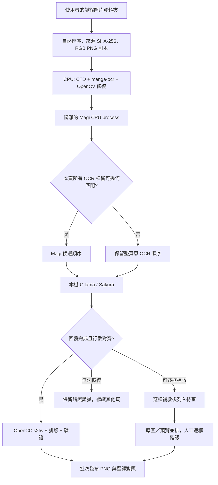

# 架構、資料流與可靠性界線

本工具的主流程是：資料夾匯入 → 文字偵測與日文 OCR → Magi 閱讀順序候選 → Sakura 翻譯 → 繁體正規化 → 排版與圖像輸出 → 必要的人工審查。ComfyUI 是原始開發工作區名稱，這個發佈包的資料夾翻譯器沒有呼叫 ComfyUI server，也不需要使用者先建立 ComfyUI workflow。

## 為何分階段

OCR 漏字、閱讀順序錯誤、翻譯行數不對、翻譯語意偏差、抹字傷圖、中文字溢出，是不同原因的問題。將它們拆開，才能保留可檢查的中間結果，在失敗時判斷要重做哪一段，也能讓已完成頁先輸出。這個架構重視來源、模型與工作紀錄的可對照性；雜湊正確並不等於翻譯正確。

## 程序、模型與裝置分工

| 層級 | 目前責任 | 關鍵界線 |
|---|---|---|
| PyQt6 主視窗 | 選資料夾、進度、停止、診斷、人工審查 | 長批次另開子程序；視窗顯示保存的狀態，不能只因畫面有進度就認定工作仍在執行。 |
| 資料夾工作程序 | 正規化來源、管理輸出名稱、啟動排程器、接收完成事件並發布 | 同一套安裝用 Windows 檔案鎖限制同時翻譯。來源圖不在原地修改。 |
| 排程器 | 一個 CPU 準備 worker，加上單一路本機翻譯；最多預取一批 | 不開多個 Sakura 模型並行推論；已完成的批次可先交付。 |
| BallonsTranslator runtime | CTD、manga-ocr、OpenCV 修復、Qt 排版與可編輯專案 | 使用獨立 Python 環境；本設定的偵測和 OCR 都使用 CPU。 |
| Magi runtime | 由原始工作圖片產生分鏡、文字、人物與關聯候選 | 獨立 Python 環境，預設 CPU；停用 Magi 自帶 OCR，保留 manga-ocr 的日文文字。 |
| Ollama | 優先於 `127.0.0.1:11436` 提供 Sakura，使用此專案自己的 model store | 資料夾批次遇到佔用時改選空閒 loopback 埠並核對 listener PID。Windows／Intel 組合啟用 Vulkan；不能將這條路徑稱為 PyTorch XPU 或 CUDA。 |

本機量測的機器與套件版本見 [HARDWARE.zh-TW.md](HARDWARE.zh-TW.md)。其他平臺、GPU 和 Python 組合若未經實跑，不列為已驗證支援。

## 匯入、名稱與來源保護

只讀取所選資料夾第一層的支援圖片，依包含數字的自然排序處理。輸入會套用 EXIF 方向，轉為 RGB；透明背景合成至白底，工作副本統一命名為 `000001.png`、`000002.png`。動態或多頁圖片會被拒絕，避免不知情地只翻第一格。

`file-map.json` 記錄原檔名、工作檔名、輸出檔名，以及原圖／工作圖／成品的 SHA-256。同名不同格式也有避免輸出覆蓋的命名規則。新一輪建立新的 `書名(中文)`、`書名(中文)_2` 目錄；續跑則使用原工作目錄。

來源雜湊在讀取與批次結束時重驗。這能偵測已檢查的檔案是否改變，不是作業系統層級的唯讀保護；使用者或其他程式仍可能移動、編輯來源，續跑此時會拒絕。

## 閱讀順序與方向

Magi 並不負責替換日文 OCR 文字。系統以每個 OCR 框和 Magi 文字框的交集計算 coverage 與 IoU，採用 `0.7 × coverage + 0.3 × IoU` 找最佳候選；`coverage >= 0.6` 或 `IoU >= 0.3` 才算可匹配。

本頁所有 OCR 框都匹配時，按 Magi 文字 ID 排序；同 ID 再以由右到左、由上到下的幾何順序處理。任一框沒有足夠匹配時，整頁保留原 OCR 順序。這是避免漏匹配文字被任意移到頁尾的保守策略，不是閱讀順序正確率的證明。人物框、人物群組、說話者連線也只屬候選，不構成跨頁人物身分確認。

`source_direction.py`／`source_layout.py` 以來源幾何、方向證據與字型設定建立排版請求；`sakura_layout.py` 安裝 Qt 排版調整，`bubble_guard.py` 檢查及調整文字可用範圍。自動排版仍可能縮得太小、方向不理想或傷到氣泡附近畫面，必須看成圖。

## 翻譯契約與恢復

每頁以有序 OCR 文字建立 Sakura 請求。原始請求、回覆、完成狀態和對應模型識別保存在工作目錄。只有請求內容、模型識別與預期行數符合的快取，才可在續跑時使用。收到 HTTP 成功或非空文字還不夠：程式也檢查回覆是否正常結束、每一輸入框是否有對應輸出。

正常回覆先整理行首尾格式，再使用 `OpenCC('s2tw')` 做繁體正規化。本版本沒有把 `s2tw` 宣稱為完整臺灣語彙在地化，也不能用繁簡轉換補救誤譯。公開版移除了開發期間兩組依特定 OCR 字串硬改譯文的規則，避免個案修補變成所有作品的隱藏語意規則。

只有多框頁面、回覆明確以 `done=true`／`done_reason=stop` 結束，且錯誤屬於行數對齊時，才進入逐框補救。逐框補救產生的頁面會登記為待審，正常頁面繼續。模型無回應、逾時、其他不完整輸出不會全部當作同一種可補救錯誤。

## 記憶體與排程

預設第一批最多 4 頁，後續批次 12 頁；CPU 前處理預設 4 threads，和已載入翻譯模型重疊時的預取 worker 上限為 2 threads。預取最多一批，避免整本同時展開模型與圖片記憶體。

排程器透過 Windows `GlobalMemoryStatusEx` 取得可用實體記憶體。模型已載入時，以 6.5 GiB 的可用記憶體門檻決定是否預取，必要時先卸載模型；未載入時的預取門檻為 4 GiB。這些數值是目前程式的策略參數，不是模型實際只需這些記憶體，也不是最低配備保證。主記憶體、GPU 共用記憶體、其他程式和圖片尺寸都會影響實際餘裕。

## 續跑與發布

排程識別包含頁面清單、來源雜湊、準備設定及關鍵程式／模型識別。已封存的前處理可重用；沒有完整封存的 attempt 會保留並另建新 attempt。已完成及待審頁在續跑時凍結；未完成頁在獨立的 render 子目錄處理，避免 Qt 啟動列舉圖片時重繪已完成頁。

一般批次發布先驗證成圖來源位置與 SHA-256，再用暫存檔取代單張目的圖，逐頁更新 `file-map.json` 和翻譯 ledger，最後重建 CSV。既有目的圖若與已記錄內容不同，程式會保留它並拒絕覆蓋。**這不是涵蓋整批 PNG、JSON、CSV 的單一交易**：中途磁碟寫入失敗時，部分圖可能已交付，後續紀錄尚未完成。診斷會區分工作層級寫檔錯誤和頁面翻譯錯誤；完成頁數再由實際檔案核對。

一般 JSON 寫入使用同目錄暫存檔、flush／fsync 與替換，Windows 存取／I/O 鎖定有次數上限的重試。它保護的是單一檔案替換，不會使整個工作目錄具有資料庫交易能力。

## 人工審查與視覺精修是兩條保存路徑

| 路徑 | 做什麼 | 目前限制 |
|---|---|---|
| 待審頁逐框確認 | 對待審快照逐框確認，綁定 pending、來源與預覽雜湊；全頁確認後才將該待審頁加入可發布清單。 | 接受的是該次既有預覽。人工點選通過不會讓 OCR 或翻譯自動變正確。 |
| 音效審查決策 | 使用已建立且綁定同一工作證據的 JSON，將指定區域還原為原圖；驗證允許區域外的像素沒有改變。 | 不是自動判定音效真偽；決策檔必須與頁面、issue ID、區域、來源和快照一致。 |
| 單頁視覺精修／Ctrl+S | Pillow 即時重繪譯文、字號、文字框和方向。公開版重讀磁碟狀態，核對工作已停止執行、該頁已發布、file-map 唯一且成品雜湊相符，沒有該頁的失敗／待審狀態，才保存 overrides、PNG 與成品雜湊。 | 未發布或仍待審的頁不能用 Ctrl+S 繞過審查。允許保存後仍直接依序寫檔；不會同步重建 CSV、批次 translations、verification 或人工批准收據。 |

自動版面檢查的 `needs_review`、`unverified` 和小字提示目前屬診斷警告，**不保證每一種警告都會擋住發布**。逐框補救所建立的待審 gate 是更明確的阻擋路徑。不要把「沒有待審頁」「完成 N 頁」或 `visual_review_pending` 欄位當成整本已完成人工品質審核。

## 本機資料與網路邊界

預設 CTD、manga-ocr、Magi、OpenCV 和排版在本機執行；Sakura 請求送往 loopback Ollama。Magi 子程序設定 offline，且封鎖該程序的 socket connect；它以固定本機模型、`disable_ocr=true` 及 `use_pretrained_backbone=false` 避免額外 backbone 下載。

整套程式不是網路防火牆。首次安裝依賴和模型需要下載，上游 BallonsTranslator 也保留自動依賴／模型準備及其他雲端模組。`auto_install_missing_packages=false` 只是一個模組設定，不能等同所有下載路徑都已被禁用。離線工作前應先完成安裝與本機模型檢查；不要任意切換到雲端 OCR、翻譯、視覺或圖片修復 profile 後仍沿用「預設本機」的描述。

工作 JSON、CSV、日誌與審查資料會含來源絕對路徑、作品文字、模型請求／回覆和圖片雜湊；這些都是使用者資料。Repository 的範例和測試不包含使用者漫畫，問題回報也應使用合成資料或已去除私人內容的摘錄。

## 維護與驗證

改動資料結構、來源綁定、續跑、排版或發布前，先看對應 owner 與呼叫鏈，再測完成、部分成功、停止、檔案改動與重試等可觀察結果。更新模型或套件時，另建測試環境，記錄雜湊與版本；不要在已可工作的安裝目錄直接全面升級。

公開包的語法、單元／回歸測試和乾淨安裝可行性是不同層級的證據。只跑測試、成功 import 或成功開 GUI，都不足以宣稱新機器已通過整本翻譯。版面、語意及新環境完整推論仍需以實際輸出驗證。

發佈準備新增的 11 個模型下載／驗證測試使用合成 bytes 和攔截的網路介面，涵蓋正確下載、雜湊／大小錯誤、既有檔保留、ZIP 成員歧義與路徑越界。14 個精修保存閘門測試使用合成圖片／狀態，涵蓋允許已發布頁、拒絕待審與變動成品等情況；其中一個建立真實 PyQt6 offscreen 審查視窗，確認磁碟狀態已變成待審、畫面仍持有舊狀態時，Ctrl+S 和直接保存入口仍會拒絕寫入，重新整理後按鈕停用。這些測試沒有下載或執行模型，也沒有驗收可見桌面的完整操作流程。
