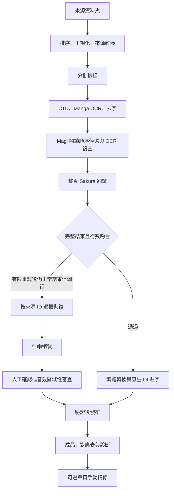

# 開發紀錄：從本機翻譯實驗到可續跑、可審查的漫畫工具

整理日期：2026-10-08。本文說明有紀錄支援的設計決策、故障與修正，不把所有試驗描述成成功，也不將流程完成視為翻譯品質通過。

## 如何閱讀這份紀錄

這個專案從 Windows 本機工作環境逐步演進而來。2026-10-01 至 2026-10-04 的實測有儲存當時程式、輸入指紋、輸出核對與驗收摘要；後來的排版、單頁精修與記憶體政策仍有變動。因此，本文區分三種證據：

| 證據型別 | 可以支援的結論 | 不能支援的結論 |
| --- | --- | --- |
| 歷史真實執行 | 指定日期、當時版本、指定樣本的模型與 GUI 行為 | 新版本、另一臺電腦、任意作品的相同行為 |
| 隔離控制測試 | 重試、停止、狀態儲存、輸入驗證等特定機制 | 真實模型語意、整本品質、實際吞吐量 |
| 公開準備時的程式核對 | 目前有哪些路徑、常數、檢查與限制 | 尚未重新執行的端對端成功 |

原始測試使用的漫畫、作品名稱、對白、圖片、完整模型請求、私人資料夾和舊工作資料沒有放進公開專案。下列數字是已匿名化的歷史摘要，公開讀者無法用私有原始樣本完整重現它們。程式連結用來檢查機制，不是假裝公開了所有歷史測試證據。

本文的「思路」指可說明的工程理由與取捨：想解決什麼、觀察到什麼、採取什麼設計、驗證到哪裡。它不是當時逐句對話或未儲存的思考過程。

## 最初要解決的事情

目標是讓使用者選取一個日文漫畫圖片資料夾，在自己的電腦完成辨識、翻譯、去字和貼字，再得到能閱讀、能修訂的繁體中文圖片。來源需要保留；一頁失敗不應讓整冊已完成的工作作廢；有疑問時，需要看得出是哪一頁、哪個階段和哪筆回覆出了問題。

開發機是 Windows 11、Intel Core Ultra 7 258V、Intel Arc 140V 整合式 GPU、32 GB 等級的共享系統記憶體。這個硬體選擇會直接影響架構：OCR、影像前處理和 Magi 可以走 CPU；Sakura 透過 Ollama 的 Vulkan 後端使用 Intel GPU。CPU 和 GPU 仍競爭同一臺機器的記憶體、頻寬與功耗，不能直接套用有獨立 NVIDIA 顯示卡的併行經驗。

因此沒有為了新增漫畫功能而重建既有 ComfyUI 環境。BallonsTranslator 的 Python 與 Magi 的獨立環境分別承擔適合的工作。這是依賴隔離，不是作業系統安全沙盒；模型和依賴仍需事先準備，也不能把「本機推論」擴張成「首次安裝完全不用網路」。

## 階段演進與元件分工

| 階段 | 當時的主要問題 | 採取的方向 |
| --- | --- | --- |
| 2026-10-01 | 先建立能在本機完成的翻譯路徑 | BallonsTranslator、日文 OCR、Sakura、繁體轉換與原生貼字 |
| 2026-10-01 至 10-02 | 長冊等待、回覆中斷、整本重做 | 分批、有限重試、回覆紀錄、快取與續跑 |
| 2026-10-02 至 10-03 | 壓框、頁邊文字、裁切不全、方向不明 | 實際字形量測、區域性修補、保守 OCR 複查與來源繫結 |
| 2026-10-03 | 漏行能恢復，但恢復結果仍可能翻錯 | 逐框補救、待審預覽、人工音效決定與發布閘門 |
| 2026-10-03 至 10-04 | 長冊進度、發布存檔失敗、使用者不知道怎麼處理 | 真實長冊測試、終態核對、診斷清單、Windows 有界儲存重試 |
| 後續至公開準備 | 手動精修效率、高解析排版與記憶體常駐 | 新增快速預覽與排版策略；重新界定舊驗證能支援的範圍 |

目前的主要資料流如下。人工精修和已封存預覽的人工核准是不同路徑，不能共用同一份畫素一致性承諾。

以下每個案例都分開描述症狀、原因、修正、證據與界線。

## 案例 1：不是把大模型接上去就完成翻譯

**症狀。** 最早的小樣本能產生中文，但人物指代、句子語氣和因果仍可能錯誤。輸出的 PNG 正常、所有框也有文字，仍不代表內容正確。

**判斷。** 漫畫的原文常省略主詞，分句短，還混有擬聲詞。文字模型看到完整一頁也不一定知道誰在對誰說話。繁體轉換只能處理字形與部分詞彙，不能修正錯誤的人物關係。

**設計。** 先保留日文 OCR、來源 ID、模型原始回覆和最終譯文的對應；使用 Sakura 作本機翻譯，經 OpenCC `s2tw` 轉換成繁體，再交給版面工具。把「模型有回答」「文字對上原框」「意思正確」拆成不同檢查。

**歷史驗證。** 2026-10-01 的兩頁本機流程重新執行偵測、OCR、Sakura、轉換、去字與貼字，耗時約 83.8 秒；26 段輸出逐一與該次本機回覆核對。當時紀錄仍指出數處指代與語氣問題，沒有宣告全書翻譯品質通過。

**限制與公開整理。** 當時沒有人工改寫模型答案，是那個版本的驗收條件。公開準備時發現後續版本曾加入兩組固定詞句替換；公開副本已移除這些與特定樣本耦合的分支，原有本機工作環境保持原樣。這是公開整理的修改，沒有假稱已重跑當年的所有模型驗收。公開版仍會排除空行、去除每行兩端空白和外層引號，再做 OpenCC 轉換與版面換行，因此也不應把簡短的 `POLICY` 字串理解成輸出與模型回覆逐位元組一致。手動精修則另存 override，屬人工修改。模型選擇與一兩頁比較不足以建立普遍的語意準確率。

對應程式：[批次翻譯與繁體轉換](../tools/local-manga-translation/batch_pipeline.py)、[本機模型通訊](../tools/magi-pilot/run_context_probe.py)。

## 案例 2：上游參數格式改變，Sakura 還沒推論就無法啟動

**症狀。** BallonsTranslator 新版把參數包成帶有 `value` 的結構，舊 Sakura 模組卻仍把整個字典當成檔案路徑交給 `os.path.exists`。錯誤發生在建立翻譯器時，與模型翻譯品質無關。

**修正理由。** 正確修正位置是模組參數相容層，而不是重灌模型或替換整個已可工作的 Python 環境。相容處理需要同時支援舊的平面值和新的包裝值，並保持正常 API 參數型別。

**歷史驗證。** 儲存修改前檔案，增加舊格式、新格式、字典路徑／版本更新和實際 API 型別的四個回歸案例；本機兩頁端對端流程才在此後完成。

**限制。** 這是針對當時 BallonsTranslator 介面的修正。上游後續變更仍需重新核對；不能把第三方原始碼的一次相容修正描述成所有版本均受支援。公開版的上游補丁與固定版本應和安裝說明一起維護。

## 案例 3：HTTP 200 不能當作翻譯完成

**症狀。** 一次 188 頁工作的前處理已花約 21 分 12 秒，接著某頁取得 HTTP 200，串流卻提早結束；預期五行只收到三行。舊程式直接中止整本。

**原因界線。** 當時缺少完整網路串流，因此只能證明回覆不完整，不能事後把它定性為顯示卡故障。HTTP 成功碼只代表連線層的結果，不保證模型已完成回答。

**修正。** 以 `done=true`、正常的 `done_reason=stop` 和預期非空行數一起判斷完成；有限重試最多三次，前兩次串流、最後一次非串流。保留各次請求與回覆，不拼接中止片段，不把缺行文字發布為成品。

**歷史驗證。** 本機 HTTP 控制案例涵蓋串流、斷線、重試和快取；失敗隔離讓其他頁繼續。該版本另驗證正常頁內容與舊流程一致。

**限制。** 正常結束且行數吻合只是結構條件。三次重試後仍失敗時，需要保留錯誤；無限重試既沒有品質保證，也可能讓整冊工作無法結束。

對應程式：[回覆完整性與重試](../tools/magi-pilot/run_context_probe.py)、[單頁失敗隔離](../tools/local-manga-translation/batch_pipeline.py)。

## 案例 4：重試完全相同的請求，反而一直重現模型迴圈

**症狀。** 某些失敗頁的三次回覆完全一樣，結尾有長串重複片段，缺少正常完成標記。改成非串流或只換 seed，並未可靠修復。

**調查。** 原案件沒有開伺服器 DEBUG，不能聲稱直接讀到了它的中止原因。另用中性文字重現後，DEBUG 出現 token repeat limit reached，支援重複生成造成中止的機制。

**修正。** 首次請求保持原設定；只有符合重複迴圈特徵的失敗才調整恢復參數。在該次試驗採 `frequency_penalty` 0.2、再 0.3 的有限恢復，仍要求完整結束與行數吻合。正常完成但含連續標點的文字不應自動被刪除或改寫。

**歷史驗證。** 中性回覆重播、真實 Sakura 請求與完整快取重用都曾驗證；一般日文首次請求與直接 API 基準一致。沒有因此重新處理原案件全部失敗頁。

**限制。** 恢復參數會改變取樣分佈，措辭和標點可能跟著變。這是避免模型生成迴圈，不是語意修正器，也不是保證每頁一定成功的策略。

對應程式：[重複尾端判定與請求紀錄](../tools/magi-pilot/run_context_probe.py)。

## 案例 5：等整冊前處理完才看到第一頁，使用者無法及早確認結果

**症狀。** OCR、去字和 Magi 全部結束後才開始翻譯，第一頁等待過長；後面出錯又很難沿用前面的工作。

**設計。** 首批最多四頁，之後預設每批十二頁，批次完成就發布。最多一個 CPU 前處理 worker 和一個翻譯流程，只預先準備下一批。CPU 預算在獨立工作與模型重疊時分開配置。

**歷史量測。** 相同八頁、每組一次的測試中，舊流程首批與整體完成都是 299.9 秒。採用的混合排程首批為 212.6 秒、整體 311.8 秒：首批約提早 87 秒，整體卻約慢 12 秒。

**取捨。** 這項變更的已證實優點是較早看見成品、較小的失敗重做範圍，以及可重用中間資料；不能把約 29% 的首批改善寫成整體翻譯加速 29%。

**限制與目前狀態。** 歷史排程使用的記憶體門檻和解除安裝策略，與後續 6.5 GiB／60 分鐘保活策略不同。舊八頁測試和長冊結果不能直接驗證後來政策的效能。

對應程式：[有界預先處理排程](../tools/local-manga-translation/run_magi_scheduled.py)。

## 案例 6：續跑要儲存已完成成果，也要拒絕沿用過期資料

**症狀。** 單純看到成品檔存在就跳過，可能錯用修改過的原圖、另一個模型的回覆或不同排版版本；重新跑整頁，又可能改掉使用者已確認的成果。

**設計。** 對來源、正規化圖片、模型身分、配置和部分策略程式記錄雜湊；準備完成後才封存可重用的中間資料。續跑核對身分與產物，完成頁與待審頁保留。必要資料改變時停止沿用，讓使用者保留修改、另建工作。

**歷史驗證。** GUI 曾先發布四頁、停止、再續跑；先前 PNG 的雜湊保持一致。舊版已完成的 OCR／Magi 可以匯入新排程，完整回覆沿用、不完整回覆重試；原始舊工作不重寫。

**取捨。** 嚴格繫結會讓部分舊工作因設定或程式版本改變而不能直接續跑。這比悄悄混用不同生成條件更容易理解，也能保留可追溯性。

**限制。** 雜湊檢查可以發現變更，並不能還原所有已遺失檔案或證明翻譯正確。公開準備後的程式修改需要新的工作或明確的遷移驗證，不能略過檢查來求方便。

對應程式：[準備資料封存與 profile](../tools/local-manga-translation/batch_pipeline.py)、[排程續跑核對](../tools/local-manga-translation/run_magi_scheduled.py)。

## 案例 7：埠被佔用，不代表可以接管別人的 Ollama

**症狀。** 原流程要求固定埠空閒；一次原生 Qt 程式異常退出，留下先前工作自己的閒置服務。即使這次只貼字、不需要翻譯，也會被埠占用阻擋。

**原因。** 服務生命週期和功能需求沒有完全分開。headless 的純貼字階段仍啟動 Ollama，增加留下殘留程式的機會。

**修正。** 設定明確停用所有 LLM 功能的前處理／貼字階段，略過模型服務。排程使用的 `LocalServer` 優先嘗試指定埠，被佔用時選擇其他 loopback 埠，建立自己的服務；以子程式存活、監聽 PID 和模型 digest 一起核對身分，清理也只針對自有服務。

**歷史驗證。** 舊服務仍在時，新服務可於其他埠啟動、核對模型並正常清理，舊服務 API 狀態不變。儲存完整翻譯的貼字工作在服務全關閉後重畫，輸出雜湊與基準一致，沒有新增模型服務日誌。

**限制。** GUI 啟動器和排程 `LocalServer` 的入口不同；不能宣稱每個入口都有完全一樣的動態選埠行為。服務程式退出與埠關閉也需要實際核對，不能只根據一個清理命令的返回碼判斷。

對應程式：[不需要 LLM 時略過啟動](../tools/local-manga-translation/launch_ballons_sakura.py)、[排程服務所有權](../tools/magi-pilot/run_context_probe.py)。

## 案例 8：為了修一個壓框，卻把整頁字型都改掉

**症狀。** 文字壓到泡泡邊線後，簡單增加全頁字級上限或統一換行，雖然可能縮排框內，卻會改掉原先已接受的其他區塊。

**歷史修正。** 先精確重現原生成結果，再用 Qt 實際渲染的字形畫素判斷是否超出可確認的白色泡泡。只對觸發的區塊，依序嘗試保留字級的移位、框內重排、必要時有限縮字。驗證候選不通過就還原。

**歷史驗證。** 一頁基準曾重現為零畫素差；啟用區域性補救後只修改目標區塊，其餘十個區塊的樣式、位置與字形不變，目標新舊字形範圍外也沒有畫素差異。

**限制。** 灰底、開放框線、背景連通或無法可靠對應 OCR 的區域，不能勉強當成封閉泡泡。`unverified` 表示未能驗證，不等於安全；`needs_review` 表示沒有安全自動解法。

**版本差異。** 後續版加入了更廣泛的 `fitted_layout` 字級與版面處理。上述「只改一框」是歷史區域性補救實測，不能當成目前整個排版流程的通用承諾。

對應程式：[實際字形壓框檢查](../tools/local-manga-translation/bubble_guard.py)、[批次排版接點](../tools/local-manga-translation/sakura_layout.py)。

## 案例 9：頁邊旁白和跨頁邊泡泡被保守規則漏掉

**症狀。** 有的窄旁白連著整頁外部白底，有的泡泡延伸到頁面底部。若一律排除碰到頁邊的白區，文字即使真的跨線也不會修正。

**修正。** 為有限且可辨認的情況加入條件：單一頁邊、原 OCR 位置、白底比例、區域大小及覆蓋；窄旁白還要求連續的深色分格線。多邊開放白區仍不直接當作泡泡，旁白也只在字形真的跨越分格線時觸發。

**歷史驗證。** 兩頁分別有 1,357 與 1,300 個越界字形畫素，修正後降為零。一頁只移位並保留字級，另一頁重排與縮小目標字級；其餘十四個文字區塊的資料和字形保持不變。新增頁邊案例連同既有回歸合計三十九項通過。

**限制。** 規則依賴白底和可辨認的邊線，不是所有漫畫風格的氣泡分割器。有效的失敗基準也是多次校正測試後建立的；早期測試記錄方式不正確的輸出沒有被拿來當作修正成功證據。

對應程式：[頁邊與旁白區域辨識](../tools/local-manga-translation/bubble_guard.py)。

## 案例 10：OCR 裁切少一筆，翻譯再流暢也只是翻錯的輸入

**症狀。** OCR 框切到字的一部分，辨識結果錯誤；直接交給翻譯模型，無法期待它知道框外缺了什麼。

**設計。** 從原裁切邊界延伸的連通墨跡判斷是否有有限的補全範圍。兩個灰階閾值需要對範圍一致，不能碰到搜尋邊界、帶入其他文字框或額外圖案。補全後，無白邊和每側加二畫素白邊各辨識一次，只有非空而且兩次一致才更新來源文字。

**為什麼只改文字。** OCR 補全的目的不是重新排版或重新去字。程式對照更新前後資料，確認除來源文字之外的欄位全部不變，並保留原 OCR、原閱讀順序與複查結果。

**歷史驗證。** 二畫素白邊方案有二十八項檢查通過；真實 OCR 複查約 6.42 秒，其他六個區塊、所有版面欄位和來源／遮罩／去字／結果圖片保持不變。該試驗沒有啟動新翻譯或新排版。

**限制。** 雙讀一致不代表必然辨識正確；旋轉文字、不支援的字形尺度、灰暗複雜背景和幾何不確定案例可能保留原文並標記待查。它不能從手寫擬聲字的一個錯誤答案推匯出正確語意。

對應程式：[保守裁切複查](../tools/local-manga-translation/ocr_crop_review.py)。

## 案例 11：單字無法可靠判斷橫排或直排

**症狀。** 單一字或數字的外框接近方形，用寬高比例直接選方向，容易跟同一泡泡的鄰近句子不一致。

**設計。** 只有方向不明的短區塊、同 Magi 群組記憶體在一致多字方向證據、又位於同一可靠泡泡時，才提出群組校正。群組限制在二至四個成員，橫直排對稱處理；用同一 Qt 引擎形成候選，核對泡泡邊界、字形互撞與原文行欄順序。

**保護。** 不為了放入候選而刪標點或縮字；放不下就保留原生結果。候選失敗時要還原浮點座標、字型、逐字格式與來源位置；還原不完整就停止渲染。來源和候選資料用 manifest 繫結，舊專案缺少或過期記錄時不強行套用新規則。

**歷史驗證。** 指定目標泡泡與核准參考一致；缺少／過期輸入能回到原版結果。兩頁同程式測試確認新校正的範圍，當時合計六十九項回歸完成，其中一項 Windows 暫時存取鎖經單項重跑通過，測試記錄有保留。

**限制。** 原生多頁與單頁渲染仍有背景條件造成的差異，對照組也能重現，因此沒有宣稱多頁整張 PNG 一律與單頁參考相同。當時驗證使用 PyQt6 offscreen，沒有驗證 PyQt5。

對應程式：[方向提案](../tools/local-manga-translation/source_direction.py)、[群組候選與還原](../tools/local-manga-translation/source_layout.py)。

## 案例 12：Magi 的閱讀順序和說話者候選不能當成語意答案

**疑問。** 既然模型能辨識分鏡和人物，是否就能自動知道每句對白的主詞、受詞、真實姓名與因果？

**設計邊界。** 實際整合使用已有日文 OCR，再把 OCR 框匹配到 Magi 的文字順序。只有每個 OCR 框都得到足夠可信的對應，才使用該順序；至少一框未匹配時，保留整頁原 OCR 順序，避免把未知框悄悄挪到尾端。

**理由。** 頁內匿名角色關聯和跨頁身分不是同一件事。候選說話者也不是句子的語法主詞，更不能直接推出動作受詞或聽話者。把這些不確定資料當作確定提示，可能讓模型更有把握地翻錯。

**驗證與限制。** 本機歷史試驗保留了結構與語意分開的審查；正式順序程式明確保留所有 OCR 框和回退原因。這不支援「Magi 解決所有漫畫上下文」或「有影象理解就不需語意校對」的說法，也不把未啟用的場景敘述試驗算成正式功能。

對應程式：[OCR 與 Magi 對應及整頁回退](../tools/local-manga-translation/run_magi_batch.py)、[獨立本機 Magi 執行](../tools/magi-pilot/run_probe.py)。

## 案例 13：逐框補救成功，不等於這一頁可以交付

**症狀。** 某頁原本有七個來源框，整頁重試仍只回六行。模型雖正常結束，不能安全地把六行猜配給七框。

**修正。** 正常整頁重試用盡、最後確實為 `stop` 且屬行數不符的多框頁，才逐框請求。每筆繫結原來源 ID；所有框都取得完整非空單行回覆才組合成預覽，最多三十二框，每框仍受既有重試限制。原整頁失敗回覆保留，組合結果另外記錄來源，不冒充一次整頁模型回答。

**先做隔離原型。** 早期試驗得到七個框的完整回覆，也完成貼字，但其中有 OCR 把手寫音效辨識成數字、短音效被翻成不相干詞語的問題。因此驗收只認定結構恢復，狀態仍為待審。

**後續正式整合。** 加入 `ReviewRequired` 和 `pending.json`，補救頁不直接進中文成品。真實失敗驗收記錄三次整頁請求加七次逐框請求；預覽完成但沒有發布，已成功頁保持不變，待審續跑也不再次呼叫模型或重畫。

**限制。** 原型的 `accepted` 只表示補救結構完整。語意審查另有明確狀態，不能拿這個欄位當人工批准。單框翻譯也失去部分整頁語境，尤其不能期待它自動修好 OCR 或人稱問題。

對應程式：[逐框補救與來源繫結](../tools/local-manga-translation/translation_recovery.py)、[正式觸發條件](../tools/local-manga-translation/batch_pipeline.py)。

## 案例 14：擬聲字無法可靠翻譯時，儲存原圖比捏造文字更可追溯

**症狀。** 逐框恢復能補齊行數，卻把手寫音效變成錯誤數字或一般詞語。若只是讓系統「湊足行數」，問題會直接出現在成品。

**設計。** 人工對照原圖確認哪些是音效、哪些是正常文字，記錄來源 ID 和固定矩形範圍，再套用區域性審查決定。程式恢復指定範圍的原影象素，核對範圍內與原圖一致、範圍外與原預覽一致；移除被還原音效的錯譯匯出列，保留原模型回覆供追溯。

**歷史驗證。** 正式整合留下五十五項回歸、三十四項套用／發布／續跑檢查、十五項真實模型失敗補救檢查及 GUI 子程式測試。區域性套用之外的畫素不變；重複套用與續跑保留已完成頁。

**後續人工預覽確認。** `page_review.py` 另提供逐框確認原封存預覽的機制：全部來源 ID 確認後，才儲存批准收據和發布資格；預覽或繫結改變時拒絕沿用舊確認。它與「把音效區恢復成原圖」是兩種不同決定。

**限制。** 沒有自動音效分類器，也沒有人工語意能力的替代品。Ballons 手動重開或再次整頁渲染可能重建文字層；歷史測試的另一次重繪出現 2,335 個畫素差異，因此只承諾已驗證的區域性套用，沒有承諾任意編輯器重繪後仍完全一致。

對應程式：[音效區域性審查](../tools/local-manga-translation/sfx_review.py)、[封存預覽逐框確認](../tools/local-manga-translation/page_review.py)。

## 案例 15：中斷發生在多個檔案更新之間，留下彼此矛盾的工作狀態

**症狀。** 續跑寫入新譯文後、驗證記錄提交前被中斷，舊 verification 可能與新內容不一致。另一種情形是某批審查通過，但其他已驗證批次尚未發布，工作卻提早顯示完成。

**修正。** 把新的 verification 定義為部分重跑提交點。提交前中斷時，恢復上次有效輸出與原修改時間，留下原始模型回覆和未提交資料；提交後則核對已提交狀態。跨批發布要把所有已驗證批次補齊，再核對對應表、PNG 雜湊和實際張數。

**歷史驗證。** 測試覆蓋取消、程式突然終止、提交後終止、備份損壞與跨批次中斷重套。相同 PNG 不重寫，避免讓已確認成果的修改時間無端變動。

**限制。** 這是特定流程的恢復協定，不是整個資料夾的資料庫交易。外部刪檔、磁碟損壞、缺失備份或任意新入口，都需要自己的對應處理。

對應程式：[部分重跑檢查點](../tools/local-manga-translation/batch_pipeline.py)、[區域性審查驗證](../tools/local-manga-translation/sfx_review.py)。

## 案例 16：完成百分比很漂亮，實際成品卻可能缺檔

**症狀。** 只沿用排程內的完成計數，可能在輸出檔被移走、修改或發布失敗後仍顯示全部完成。OCR 已跑到哪一頁，也不等於哪一頁已交付。

**修正。** 完成數只在成品發布後增加；分開顯示待審頁、頁面失敗和工作錯誤。結束時重新核對產物存在、可解碼性、對應表和雜湊。待審或失敗時不顯示「全部成功」的 ETA；只有全部完成且程式正常退出才記錄完成時間，其餘為結束時間與相應狀態。

**真實長冊證據。** 2026-10-03 的 206 頁測試完成到結尾，發布 204 頁、保留 2 頁待審、其他頁面失敗為零。發布的 204 頁含 200 頁文字翻譯和 4 頁未偵測文字而保留原圖。先發布四頁、刻意停止後續跑，先前成果的雜湊與修改時間不變。

**時間不能混用。** 續跑那次耗時約 2 小時 34 分 56 秒；包含首次啟動、停止與續跑的整體牆鐘時間約 2 小時 39 分 1 秒。之後八秒左右的全快取核對沒有重新 OCR、翻譯或貼字，不能被拿來宣稱八秒翻完整冊。

**品質界線。** 當時沒有逐頁人工審查；自動版面紀錄另有 231 個需檢視區塊，分佈於 105 頁。版面提醒與阻止發布的兩頁待審是不同狀態。300／500 頁的控制測試用了模型替身，也不能當作真實 500 頁速度或記憶體實測。

對應程式：[進度、發布與終態核對](../tools/local-manga-translation/folder_translator.py)。

## 案例 17：CPU 和 GPU 同時工作，不保證總速度更快

**症狀。** 長冊某些批次在準備下一批時，Sakura 每 token 生成速度下降。相鄰批次的中位數曾從約 4.38 token/s 降至約 1.86、1.85 token/s。

**排除與未排除。** 當時兩個較慢批次沒有額外整頁重試或逐框補救，模型每頁載入時間也很短；服務紀錄仍顯示 Intel Vulkan 和 49/49 層 GPU offload。這支援「生成階段確實變慢」，不支援「一定掉回 CPU」。頁面 token 數也不同，不能直接拿每頁秒數算效能退化倍數。

**設計取捨。** 有界預先處理和較低 CPU 執行緒預算用來控制競爭；後續加入較高的可用記憶體門檻，嘗試在保活與解除安裝間取捨。這些都是政策，不是硬體資源的絕對保證。

**歷史量測。** 206 頁測試每三十秒取樣：程式家族 RSS 加總最大約 15.63 GiB，系統最低可用記憶體約 2.31 GiB，未觀察到 OOM 或崩潰。RSS 加總可能重複計入共享頁面，取樣也可能漏過瞬間峰值。

**限制。** 沒有相同頁面的受控 A/B、完整功耗、溫度、頻率或頻寬紀錄，不能認定 CPU 競爭是唯一原因，也不能量化停用預先處理的改善。新 6.5 GiB 門檻／60 分鐘保活尚不能引用上述舊版本長冊測試為完整驗收。更不能根據門檻就保證 100% 不會 OOM，或把 GPU 共享記憶體當成額外獨立 RAM。

對應程式：[目前記憶體政策與監看](../tools/local-manga-translation/run_magi_scheduled.py)。

## 案例 18：Windows 存取被拒，必須分清「翻譯失敗」和「成品發布失敗」

**症狀。** 一次 212 頁工作在把暫存對應表替換成正式檔時發生 `PermissionError / WinError 5`。最後完整發布檢查點是 157 頁，磁碟已有 160 張 PNG，另有已渲染未發布頁。當時三頁待審、沒有已知的模型／頁面翻譯失敗。

**不能做的推論。** 最後出現的模型頁號不是儲存失敗的頁號；磁碟 PNG 數也不等於完整提交計數。舊紀錄沒有 traceback 或佔用者資訊，不能指認防毒軟體、索引程式或某個背景程式。

**儲存修正。** JSON 先序列化，再於同目錄建立唯一暫存檔，寫入、flush、fsync、關閉，最後替換目標。只對 Windows 5／32／33 的替換錯誤重試；持續拒絕仍丟擲原始錯誤，清理失敗附加說明，不蓋掉主因。

**歷史驗證。** 用真正 Windows 檔案 handle 禁止 DELETE 分享來重現舊版錯誤，釋放 handle 後候選成功。2026-10-04 的十四項測試驗證的是六次嘗試、合計 775 ms 排定等待的舊政策。

**目前差異。** 公開準備時現版已是八次嘗試、七段等待合計 4.35 秒；OS I/O 時間另計。後續參數改動不能自動繼承舊十四項測試的全部數字結論。公開副本已將原碼中殘留的「六次／775 ms」錯誤附註改成與目前行為一致，沒有更改正式本機環境，也沒有把文字修正當成重新驗證舊案件。

**診斷修正。** GUI 增加頁面問題清單、工作錯誤分層、完整原始錯誤和可複製診斷。收尾再發生錯誤時另存為 secondary，不覆蓋初始故障。歷史 GUI 驗證用 offscreen，外部開檔和剪貼簿使用受控替身，沒有把這些測試描述成所有可見桌面行為都已驗證。

**限制。** 原子替換只對單一檔案生效，不是多檔交易，也不能解決永久許可權錯誤、磁碟滿或長時間鎖。唯一暫存名稱避免同名碰撞，卻不會替多個 writer 合併資料。

對應程式：[有界 JSON 儲存](../tools/local-manga-translation/atomic_json.py)、[只讀診斷收集](../tools/local-manga-translation/job_diagnostics.py)。

## 案例 19：單頁快速精修必須和原生批次渲染分開驗證

**需求。** 使用者已經有翻譯結果，只想更改某框文字、大小、換行或方向；重新呼叫 OCR 和大模型既浪費時間，也會讓已確認內容再次變動。

**設計。** 使用既有去字底圖，讓 Pillow 在記憶體重畫文字，儲存每頁 override，提供左右原圖／預覽和手動控制。原生批次貼字使用 Qt；快速精修使用 Pillow，字型度量、換行和標點旋轉不會天然完全相同。

**目前可確認。** 原始碼有字級分段的字距、行距、直排標點處理，以及以既有底圖重畫的路徑。這些是具體演演算法選擇；沒有足夠的公開測量可宣稱「光學排版 100% 正確」或「任何解析度均為固定延遲」。

**公開準備發現。** 舊白皮書把約 58 ms 的敘述稱為 60 fps，但每幀 58 ms 換算只有約 17 fps，且未有足夠的分佈測試與高解析條件。原始快速發布路徑直接依序寫 override、PNG、對應表，沒有使用原子 JSON helper，也沒有一起原子提交 status；不能宣稱它具有整套交易保護。

**公開副本的最小修正。** 公開檢查發現，原版快速儲存可以從待審視窗直接寫出 PNG，繞過逐框確認。公開副本在任何重畫或寫入之前，重新讀取工作狀態與對應表；只有已發布、唯一對應、目前 PNG 雜湊吻合，而且該頁不在失敗／待審清單時才允許精修儲存。工作仍執行、記錄缺失或損壞時也拒絕。部分完成工作的其他成功頁仍可編修。按鈕顯示停用原因，Ctrl+S 經過同一個儲存閘門，不以舊視窗狀態代替磁碟核對。

**驗證與保留限制。** 十四個公開合成測試用純色圖片確認待審、失敗、缺檔、雜湊改變、重複對應、損壞狀態與路徑越界均在重畫／寫入前拒絕；已發布頁可以儲存並更新成品雜湊。其中一項實際建構 PyQt6 offscreen 視窗，先按鈕儲存成功，再只改磁碟狀態為待審；即使舊視窗仍顯示已核准，Ctrl+S 和直接儲存都遭拒絕，所有合成工作檔保持不變，重新整理後按鈕也停用。沒有啟動模型、工作或可見桌面操作。這不是多檔交易改造，也沒有同步重寫原批次 verification、CSV 或批准收據，因此仍不保證人工精修後可無縫續跑。突然中斷、磁碟失敗及新狀態的整體恢復仍需另行驗證；預覽快，不能替代發布與恢復機制的驗收。

對應程式：[Pillow 快速重畫與發布](../tools/local-manga-translation/page_fast_renderer.py)、[精修視窗](../tools/local-manga-translation/review_window.py)。

公開測試：[快速精修發布閘門](../tests/test_review_publish_guard.py)。

## 案例 20：模型相同，換一臺電腦卻因私人路徑而驗證失敗

**公開準備發現。** 原本直接寫死完整 Ollama manifest digest。manifest 包含安裝位置相關的 `from` 欄位；另一位使用者即使取得相同權重、模板和參數，只要安裝路徑不同，整份 manifest 的雜湊就可能改變。原本保護模型身分的檢查因此成為可攜性障礙。

**公開副本的修正。** 新增 `model_identity.py`，先核對預期 config 與 model／template／params 三個層的 digest，再計算本機 manifest 的完整 digest。前者確認模型配方，後者繼續作為該安裝環境內的續跑身分。缺少安裝資料時允許只讀原始碼／匯入模組；實際 preflight 仍要求已安裝且身分吻合，不把「還沒安裝」誤報為可執行。

**驗證範圍。** 七個公開合成測試涵蓋不同安裝路徑、精確的本機 manifest 雜湊、config 和三個層各自變更、缺少／額外／重複層，以及必要資料缺失。這是為公開副本新增的可攜性調整，不能拿舊單機端對端紀錄宣稱新電腦已完成翻譯。模型檔案本體的完整雜湊由安裝驗證另行處理；manifest 宣告的 digest 本身不是權重檔案已完整下載的證明。

**相同原則也用在第三方程式。** 公開準備核對儲存的上游發行封裝，270 個 BallonsTranslator Python 檔案中，269 個與上游相同，另一個為 Sakura 參數相容修正。公開副本儲存供應來源清單，區分上游原碼和本機修補，不把第三方整套引擎當作自行開發。

對應程式：[可攜模型身分檢查](../tools/local-manga-translation/model_identity.py)、[第三方來源清單](../tools/BallonsTranslator/VENDOR_MANIFEST.json)。

公開測試：[模型身分驗證](../tests/test_model_identity.py)。

## 公開檔案如何避免過度宣稱

本次整理沒有直接照搬早期白皮書。以下是寫作時採取的修正準則；具體公開程式的修訂與當次檢查，以發布版本附帶的驗證紀錄為準。

| 早期說法或容易產生的誤解 | 本文採用的界線 |
| --- | --- |
| 100% 不會 OOM | 只記錄特定長冊未觀察到 OOM；共享記憶體仍有瞬間峰值和競爭 |
| Sakura 固定只佔約 3.5 GiB | 不採用未有量測支援的固定佔用數字；權重大小也不等於執行佔用 |
| 全流程約 12–20 秒／頁 | 使用實測樣本、版本和完整牆鐘時間；不把快取續跑當翻譯速度 |
| 50–58 ms 等於 60 fps | 不作這個換算；單次延遲需要明確條件與分佈 |
| 所有狀態都交易式更新 | 單一 JSON 原子替換與多檔一致性分別說明 |
| 完成頁數等於人工品質通過 | 完成代表流程與發布檢查；語意和版面仍需人工覆核 |
| 逐框 accepted 等於批准發布 | 結構恢復、待審、人工確認和發布分別記錄 |
| 所有新版沿用舊版測試通過 | 區分歷史版本、目前原始碼與本次真正重跑的檢查 |
| 全本地代表不需任何安裝下載 | 推論可使用預先備妥的本機資產；首次安裝與更新另計 |
| 自動流程永遠逐字忠於模型 | 檢查正規化、詞句規則和人工 override，分別儲存其來源 |

## 後續維護的優先順序

1. **先固定可重現的版本。** 繫結上游版本、模型 revision／digest、依賴與必要補丁；每次變更明確標示影響的階段。
2. **把測試樣本改成可公開的中性資料。** 私有漫畫的歷史數字可供參考，未來的回歸應盡量使用自製圖、合成泡泡和不含作品對白的文字。
3. **分別測結構、畫素與語意。** 結構測試檢查 ID、行數與狀態；畫素測試檢查允許的改動範圍；語意評估需要明確題集和人工標準。
4. **補足新功能的發布與恢復驗收。** 特別是快速精修與多檔更新，需在取消、程式中止和儲存失敗後仍能分辨已提交與未提交結果。
5. **再做受控效能比較。** 使用同一頁集，分別測完全序列、有限預先處理、不同執行緒與記憶體政策，記錄首頁時間、總耗時、模型 token/s、記憶體和異常頁。
6. **只報告真的測過的支援範圍。** 目前有 Windows／Intel 共享記憶體機器的歷史資料；其他 GPU、作業系統與更大解析度應另列未驗證，不能由 API 名稱推定相容。

這個專案最重要的工程取捨，是允許工具明確說「這一頁還需要人看」，並讓失敗、補救、人工決定與已完成成果各自留有可核對的紀錄。
